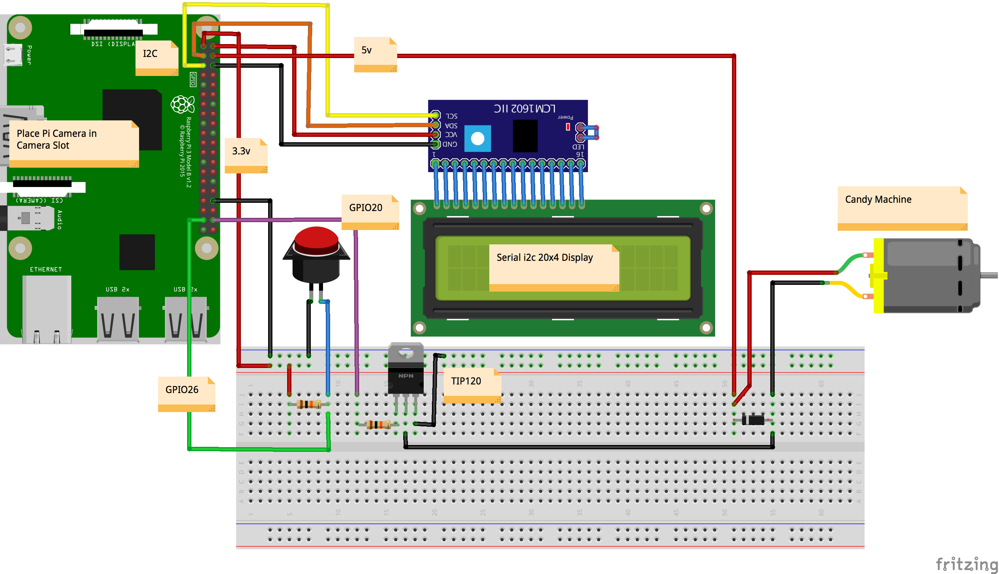

# Android Things A.I. Candy Dispenser

The Android Things A.I Candy Dispenser it's a demonstration of how to create a “smart” candy machine.
The device have a game that ask the user for a specific thing like a Bird, Dog ou Cat
and the user should show a photo of that thing in the predefined time to win candies.

This project uses a button to interact with the user, obtains images via a camera peripheral and 
a modified electric candy dispenser being controlled by a GPIO with a transistor. 

When the user takes a picture, it processes the image data using Google’s Cloud Vision API, 
which returns annotations and metadata of the image. This info is used by the device to see 
if it matches what it requested. When we have a match, the motor of the candy machine is activated 
to give the user the prize.

All users interface is presented in a Serial i2C 20x4 Display.

Pre-requisites
--------------

- Android Things compatible board
- Android Things compatible camera (for example, the Raspberry Pi 3 camera module)
- Android Studio 2.2+
- "Google Repository" from the Android SDK Manager
- Google Cloud project with Cloud Vision API enabled
- The following individual components:
    - 1 push button
    - 1 resistor
    - 1 electric candy machine
    - 1 NPN transistor
    - 1 diode
    - 1 Serial i2c 20x4 Display
    - jumper wires
    - 1 breadboard

Schematics
----------

Setup and Build
===============

To setup, follow these steps below.

* Add a valid Google Cloud Vision API key in the constant `CloudVisionUtils.CLOUD_VISION_API_KEY`
 1. Create a Google Cloud Platform (GCP) project on [GCP Console](https://console.cloud.google.com/)
 2. Enable Cloud Vision API under Library
 3. Add an API key under Credentials
 4. Copy and paste the Cloud Vision API key to the constant in `ImageClassifierUtil.kt`

Running
=======

To run the `app` module on an Android Things board:

1. Connect a push button to your device's GPIO pin according to the schematics below
2. Deploy and run the `app` module
 - Reboot the Android Things board in order to grant the camera permission (this is a known
   issue with Developer Preview )
3. Press the button to start the game and see what it asks.
4. Search for a photo and press the button to take a picture for it.
5. Wait for the results, if it succeeds it will ask you to press the button to release the candies.

# References

- https://github.com/androidthings/doorbell
- https://github.com/androidthings/sample-tensorflow-imageclassifier